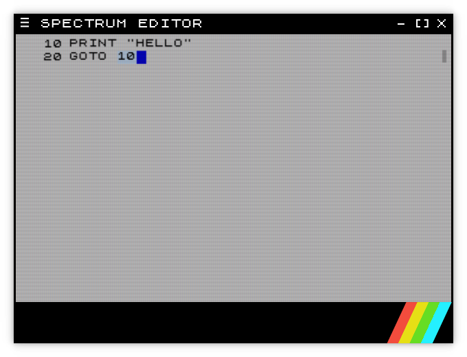

# Spectrum Editor 

ZX Spectrum style text editor

Created with Electron and NodeJS
Based on Monaco Code Editor

## Download
Downloads available from the [releases page](https://github.com/thorpelawrence/spectrum-editor/releases)

## Screenshots

